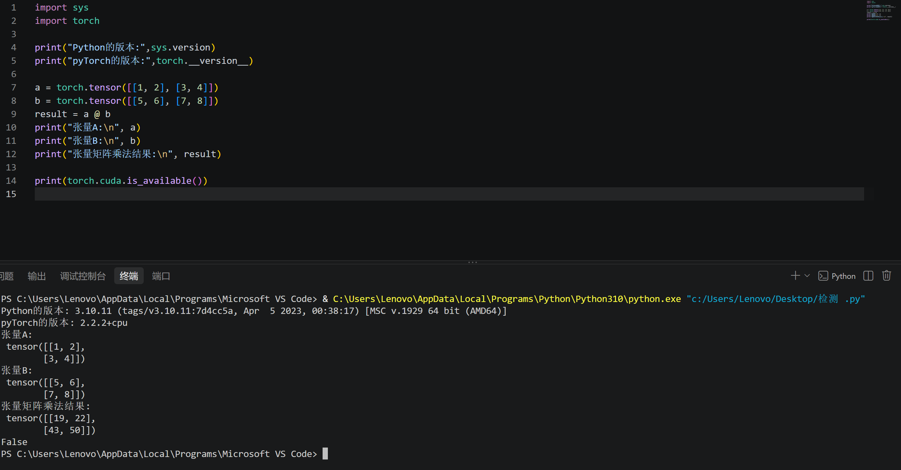

# 入门笔记
1. 人工智能、机器学习与深度学习之间有什么关系？
人工智能是一个大的范围，其中机器学习是人工智能研究的一个主要的方向。机器学习中深度学习是机器学习的一个分支。

2. 监督学习和无监督学习有什么区别？请各举一个例子。
- 监督学习：输入已经标注整理好的数据，有标签；目标明确，预测指定输出。比如：图片识别是猫还是狗,预测房价。
- 无监督学习：输入没有标签的数据；没有明确要的预测目标，用来探索数据。比如：异常检测，用户分群。

3. 数据、特征和标签分别是什么？训练集、验证集和测试集各有什么用途？
- 数据：是整个任务输入的材料，用来给模型读取
- 特征：是从原始数据里提炼出来的，比如预测房租问题中，房屋的面积，楼层等都属于特征，作为预测最终房租的一个判断依据。
- 标签：是对应数据的实际结果，比如预测房租问题中，某条数据对应的房子的实际租金就是标签。
- 训练集：这是模型的学习样本，通过训练集学习数据的底层规律、拟合特征等，在模型训练过程中使用。
- 验证集：这用于在训练过程中实时评估当前模型的效果，用来调参、选择最优模型结构、提前判断趋势。如果没有验证集，我们只能完全凭经验调参，很容易直接在测试集上反复试错，导致模型“偷偷记住测试集的特征”，最终得到的效果完全是虚高的。
- 测试集：它全程不参与训练、不参与调参，只在所有训练、调参工作全部完成后使用一次，作为最终的测试，用来客观衡量模型在完全未见过的新数据上的真实泛化能力。如果没有独立的测试集，我们根本无法判断模型是真的学到了通用规律，还是只是把手里的所有数据都背下来了。
4. batch size是什么？有什么影响？
- batch size是在一次训练（一次前向传播和反向传播）一次性所用到的数据的数量
- 因为作为训练集的样本的数量是有限的，所以如果batch size越大，那么训练的次数就越少，可能训练效果就会变差；batch size越小，样本中自带的数据噪声可能会较大影响到梯度方向，使得生成的模型效果不好。所以batch size既不能太大也不能太小，实际训练里常用的32/64/128这类中等大小的batch

5. 什么是模型和模型参数？
- 模型：为了解决特定任务定义的一套计算规则，它可以把输入的特征经过一系列运算，输出你想要的预测结果。比如线性回归。
- 模型参数：是模型里可以被自动学习、不断更新的数值，比如线性回归里的权重w和偏置b

6. 神经网络由哪些基本部分组成？什么是激活函数？为什么要激活函数？请介绍几种常见的激活函数。
- 由输入层，隐藏层，输出层组成
- 激活函数是能够使模型处理非线性问题的一个单调递增，有限，连续可求导的非线性函数
- 为了能够处理更加复杂的非线性任务。如果不使用非线性激活函数而全都是线性激活函数，那么每一层神经网络都只能做线性任务，并且无论有多少层，简单线性模型的叠加还是一个简单的线性模型。
- 经典激活函数有:
 Sigmoid：把输出压缩到0-1之间，适合做二分类输出
 Tanh：把输出压缩到-1到1之间
 ReLU：把小于0的输出直接置0

7. 矩阵如何求导？提前学习该部分数学。
矩阵求导本质上就是把标量函数对矩阵里的每一个元素分别求偏导，再把结果按照原矩阵的形状排列起来

8. 怎么用矩阵乘法表示神经网络的全连接层前向传播过程？
全连接层的前向传播可以直接写成：Y=X⋅W+b 矩阵X，权重矩阵W，偏置向量b

9. 前向传播与反向传播分别在做什么？损失函数、梯度和学习率在训练过程中扮演什么角色？
- 前向传播：正向计算，从输入层一步步到输出预测结果。
- 反向传播：从前向传播得到的预测误差开始，利用链式求导法则，从输出层往输入层反向计算得到每个参数的梯度。
- 损失函数：衡量预测值和真实标签之前的差距。作为模型优化的一个指标，梯度下降依据损失函数来计算梯度。
- 梯度：梯度是通过多元微积分计算出的一个向量，梯度指出最陡增长方向，沿着梯度的相反方向走可以让输出结果下降最快。并且可以利用梯度并调整学习率算出新的参数
- 学习率：参数更新的时候，参数沿着梯度方向前进的步长系数。本质上都是用来调整参数的。

10. 优化器是什么？有哪些？
- 优化器是深度学习框架里用来自动根据梯度更新模型参数的算法
- 动量SGD，Adam

11. 什么是过拟合，欠拟合，正则化？
- 过拟合：模型在训练数据上表现完美，但是泛化能力差
- 欠拟合：模型在训练集和测试集中的表现都很差
- 正则化：对于权重越大的数值束缚越强，防止模型对于某些特征看的过分重要，比如L1正则化，L2正则化,Dropout正则化

# 环境搭建完成

1. 为什么不同项目最好使用不同的 Python 虚拟环境？
- 1. 不同的项目对于环境的要求可能不一样。
- 2. 虚拟环境相互之间独立开来，不会彼此影响，更有利于每个项目各自的正常进行。

2. CPU 和 GPU 各自擅长什么？训练神经网络为什么经常使用 GPU？
- CPU只有少量高性能核心，擅长复杂逻辑判断、串行计算和系统通用调度
- GPU有成百上千个轻量计算核心,擅长处理图形和高重复并行计算任务
- 神经网络训练的核心步骤全是大量矩阵乘法、梯度反向传播这类高度重复的并行运算，GPU可以同时对上百个样本的运算进行并行处理，训练速度比CPU快几十到上百倍，能大幅缩短训练耗时

3. CUDA 是什么？它、显卡驱动与 PyTorch 之间大致是什么关系？
- CUDA是并行计算平台，它打破了显卡只能用来渲染画面的限制，允许直接调用显卡的计算核心来完成通用科学计算、深度学习运算。
- 显卡驱动是最底层的基础，先安装好对应版本的NVIDIA显卡驱动，系统才能正常识别、调度显卡硬件；CUDA运行在显卡驱动的条件上，提供了GPU并行计算的接口、工具库和运行环境；PyTorch再基于CUDA提供的接口，自动把神经网络的运算调度到GPU上执行，实现GPU加速训练。